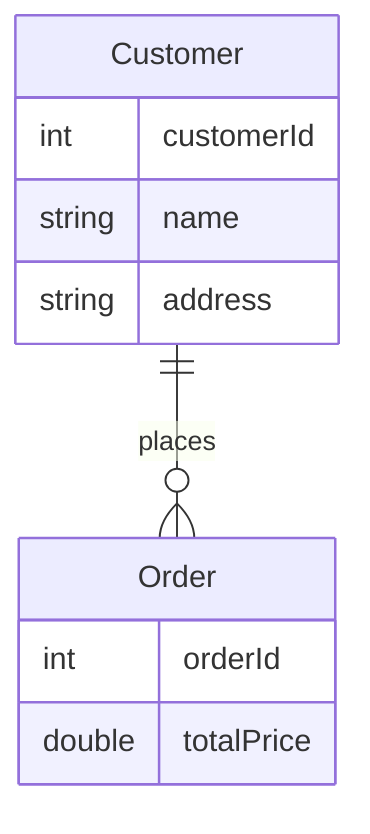
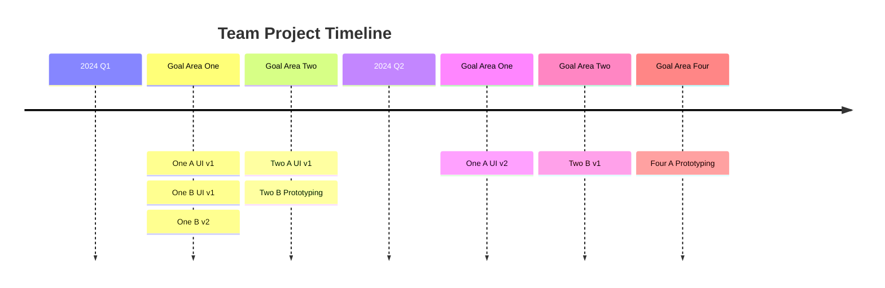

# MermaidSandbox

## ER diagram with typed fields

```mermaid
erDiagram
	Customer {
		int customerId
		string name
		string address
}
Order {
	int orderId
	double totalPrice
}
Customer ||--o{ Order : places
```

## Timeline

```mermaid
timeline
        title Team Project Timeline
        2024 Q1
          Goal Area One : One A UI v1 : One B UI v1 : One B v2
          Goal Area Two : Two A UI v1 : Two B Prototyping
        2024 Q2
          Goal Area One : One A UI v2
          Goal Area Two : Two B v1
          Goal Area Four : Four A Prototyping
```
